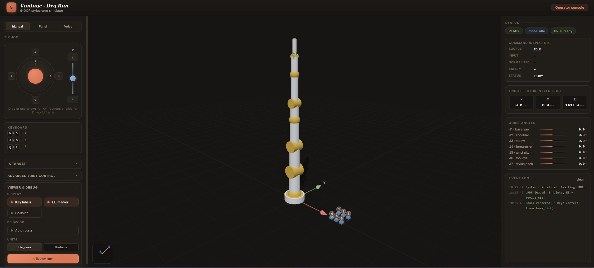
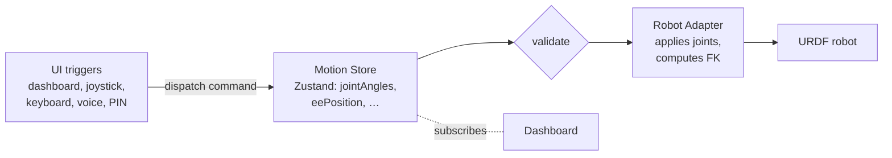
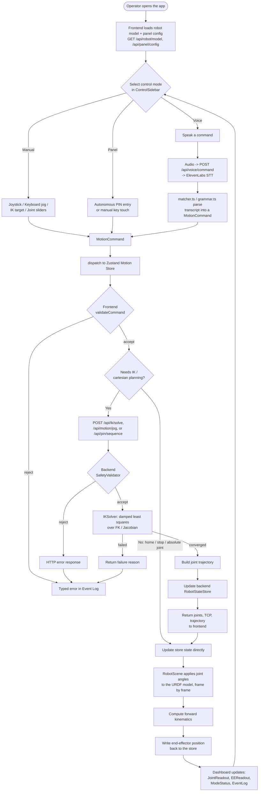
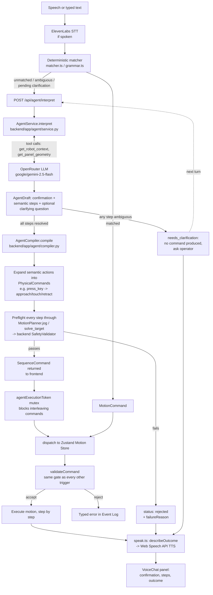
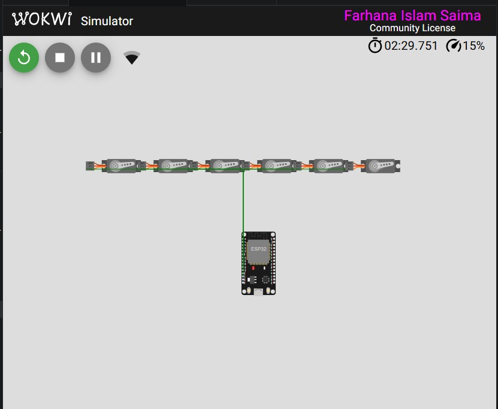
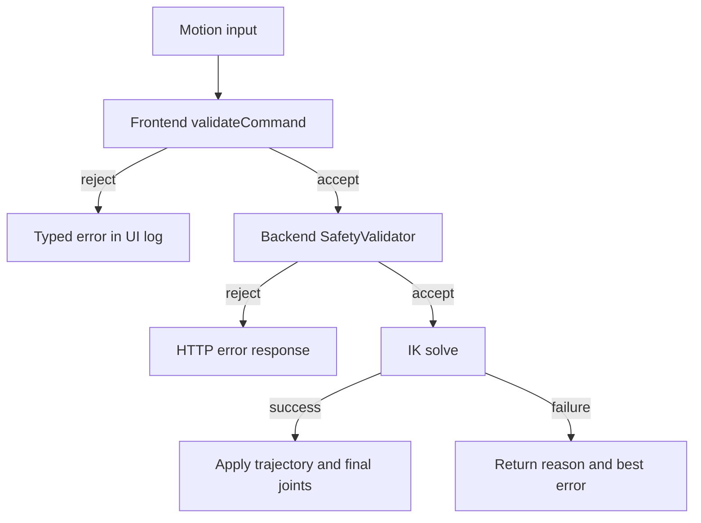

# Dry Run — 6-DOF Stylus-Arm Simulator

Browser-based simulation & control suite for Vantage Robotics' 6-DOF industrial
arm (IUT Techathon Nationals, final round). No real hardware — everything runs
in-browser from the provided URDF.

> **Core principle: one motion pipeline, five triggers.** The dashboard,
> joystick, keyboard, voice, and autonomous PIN entry are all *triggers into* a
> single authoritative motion store. Nothing owns its own copy of arm state.

## What This Builds

A web application that lets Vantage's engineers visualize, manually control,
and autonomously drive a 6-DOF industrial robotic arm (`stylus_arm`) — entirely
in a browser, with no real hardware involved:

- **7 actuated revolute joints** — `joint_1`…`joint_6` + `stylus_pitch` — plus
  a fixed stylus-tip TCP link (`stylus_tip`). No gripper, authored in meters,
  Z-up, primitive geometry only (no external mesh files).
- **A 6-key test panel** at fixed coordinates relative to the arm's base
  (`key.config.json`, provided by organizers).
- **One shared motion pipeline** reused by every control surface: dashboard,
  GUI joystick, keyboard jog, voice command, and autonomous PIN entry. Every
  command funnels through `dispatch()` → `validateCommand()` before it ever
  reaches the robot.

## Deliverables

| Provided by Organizers | Built by This Team |
| --- | --- |
| `6_dof_arm.urdf` — the 6-DOF arm with no gripper and a fixed stylus tip | Web-based 3D dashboard to visualize and move the arm |
| `key.config.json` — fixed 3D coordinates of the 6-key test panel | Visual representation of the 6-key test panel at those coordinates |
| Problem statement & judging rubric | Inverse kinematics solver |
| — | Joystick-style GUI control |
| — | Keyboard-based control |
| — | Voice-based control |
| — | Autonomous PIN-entry model |
| — | Arm's electrical schematic (Wokwi) |
| — | *(optional bonus)* Agentic natural-language voice-to-control layer |

Required for submission: a working web app demonstrating Phases 1–5, plus this
source repository (application code, system diagrams, electrical schematic).

## Final Submission Checklist

- [x] **Phase 1 — See the Arm**: URDF loads and renders in 3D; live dashboard
      (joint angles, EE position, mode/status, event log); 6-key panel
      rendered at the provided coordinates.
- [x] **Phase 2 — Move the Arm**: IK solver (target `xyz` → joint angles); GUI
      joystick jog; keyboard jog — both through the same motion pipeline.
- [x] **Phase 3 — Talk to the Arm**: deterministic voice control (ElevenLabs
      STT → grammar/matcher → `MotionCommand`).
- [x] **Phase 4 — Let the Arm Work on Its Own**: autonomous 6-digit PIN entry,
      approach/touch/retract per key, ±5 mm tolerance.
- [x] **Phase 5 — Electrical Schematic**: Wokwi ESP32 + 6-servo proof-of-concept
      circuit with power, Wi-Fi, and driving-stage architecture.
- [x] **Phase 3B (bonus) — Agentic Voice Control**: LLM reasoning layer
      (OpenRouter) that handles free-form, multi-step, and ambiguous
      instructions, compiles them into the same structured motion commands,
      and routes every command through the existing deterministic safety
      gate before it executes. See [Agentic Voice Control](#agentic-voice-control-phase-3b).
- [ ] Deployed URL *(bonus, not yet deployed — run locally, see below)*.
- [ ] Live demo video *(bonus)*.

## Live Dashboard



Live: http://137.184.201.76:3000/

## Architecture



- `jointAngles` in the store is the **only** authoritative arm state; the URDF
  robot is a *renderer* of it. The render loop reads the store each frame, pushes
  angles onto the robot, computes the stylus-tip pose via FK, and writes
  `eePosition` back.
- Every command funnels through `dispatch()` → `validateCommand()` (the
  deterministic safety gate: joint limits + workspace bounds). This is the seam
  the rubric requires — the agentic layer (Phase 3B), if added, routes through
  it too.
- **Coordinate frames**: the scene is rendered **in the base frame** (world ==
  `base_link`, Z-up), so `key.config.json` coordinates and the FK result are
  directly comparable with no conversion — the mitigation for the classic
  frame-mismatch bug.

Full component/sequence diagrams (system context, backend module diagram, PIN
sequencing, deployment topology) live in
[docs/architecture.md](docs/architecture.md).

### Operator workflow

End-to-end flow from mode selection through validation and motion planning to
the rendered result. Full detail (including the PIN-entry sequence) lives in
[docs/workflow.md](docs/workflow.md).



### Agentic Voice Control (Phase 3B)

Free-form, multi-step, or ambiguous voice/typed instructions that the
deterministic matcher (`matcher.ts`/`grammar.ts`) can't resolve are handed off
to an LLM reasoning layer instead of being rejected outright. The reasoning
layer only ever *proposes* a plan — it never touches the robot directly.



- **Reasoning layer** (`backend/app/agent/service.py`) calls an LLM over
  [OpenRouter](https://openrouter.ai) (default model `google/gemini-2.5-flash`,
  set via `ROBOT_OPENROUTER_MODEL`) with `tools` for live robot/panel context
  and a strict `json_schema` response format, producing an `AgentDraft` of
  semantic steps (`relative_move`, `jog_cartesian`, `move_to`, `press_key`,
  `jog_joint`/`set_joint`, `home`/`stop`).
- **Ambiguity handling**: if any step can't be resolved, the service returns
  `needs_clarification` with a clarifying question and **produces no
  command** — the operator answers on the next turn instead of the system
  guessing.
- **Deterministic compiler** (`backend/app/agent/compiler.py`) expands
  resolved semantic steps into concrete `PhysicalCommand`s (e.g. `press_key`
  → approach → touch → retract, repeated per `repeat` count, capped at
  `MAX_PLAN_STEPS = 24`) and preflights *every* expanded step through the
  same `MotionPlanner`/`SafetyValidator` the deterministic `/api/ik/solve`
  and `/api/motion/jog` endpoints use. Any failure rejects the whole plan
  server-side — nothing partially executes.
- **Double safety gate, never bypassed**: a compiled plan still has to pass
  the frontend's `dispatch()` → `validateCommand()` gate (recursively, per
  step) before any motion runs — the same gate every dashboard, joystick,
  keyboard, and PIN command goes through. An `agentExecutionToken` mutex
  prevents another command from interleaving mid-plan.
- **Natural-language response** (`frontend/src/lib/voice/speak.ts`) confirms
  what was understood, reports success/failure, and speaks it via the Web
  Speech API; `VoiceChat.tsx` renders the full step-by-step transcript.
- **Endpoint**: `POST /api/agent/interpret` — request:
  `{ transcript, resolutionStatus, alternatives, currentJoints, pendingPlan }`;
  response: `{ status: "ready" | "needs_clarification" | "rejected", confirmation, steps, command, clarifyingQuestion, failureReason, pendingPlan }`.
- **Requires** `ROBOT_OPENROUTER_API_KEY` (see [Requirements](#requirements));
  without it the endpoint returns `rejected` with a message pointing at the
  missing key instead of silently no-op'ing.

## Repository Layout

```
.
├── frontend/            # Next.js 14 + React + TS — the whole UI (frontend team)
│   ├── src/
│   │   ├── app/                  # Next app router (layout, page, globals.css)
│   │   ├── components/
│   │   │   ├── scene/RobotScene.tsx   # the Three.js host — "the tool"
│   │   │   ├── dashboard/             # JointReadout, EEReadout, ModeStatus, EventLog
│   │   │   └── viewer/                # JointSliders, ViewerControls
│   │   ├── components/controls/VoiceChat.tsx  # agent chat/transcript panel
│   │   ├── lib/
│   │   │   ├── motion/       # commands.ts, store.ts (Zustand), validate.ts
│   │   │   ├── robot/        # urdfLoad.ts, robotAdapter.ts (FK)
│   │   │   ├── voice/        # matcher.ts, grammar.ts, voiceApi.ts, voiceStore.ts,
│   │   │   │                 # agentApi.ts, speak.ts (Phase 3B)
│   │   │   ├── panel/        # keyConfig.ts (6-key panel loader)
│   │   │   └── viewer/       # viewerStore.ts (display prefs)
│   │   └── config/robot.config.ts     # joints, limits, EE link, tolerances
│   └── public/{urdf,config}/          # served copies of the provided assets
├── backend/             # FastAPI — IK, motion planning, PIN sequencing, voice, agent, hardware
│   ├── app/
│   │   ├── api/             # routes_health, routes_motion, routes_pin, routes_agent, routes_hardware, websocket_state
│   │   ├── agent/           # service.py (LLM via OpenRouter), compiler.py (deterministic
│   │   │                    # semantic-action -> PhysicalCommand + preflight), prompts/
│   │   ├── motion/          # safety.py, state.py, trajectory.py
│   │   ├── robot/           # urdf_loader.py, kinematics.py, ik_solver.py, limits.py
│   │   ├── pin/, panel/, voice/, hardware/
│   │   └── schemas/         # ...agent.py (AgentDraft, AgentRequest, AgentResponse)
│   ├── tests/               # pytest — FK, IK, panel/pin/motion/voice/agent API tests
│   └── scripts/smoke_ik.py  # IK smoke test across all 6 panel keys
├── hardware/wokwi/      # Phase 5 — ESP32 + 6-servo Wokwi project (diagram.json, sketch.ino)
├── docs/                # architecture.md, workflow.md, problem_statement.md,
│                         # phase5-electrical-schematic-brief.md, schematic_diag.jpg
├── 6_dof_arm.urdf       # provided by organizers (source of truth)
├── key.config.json      # provided by organizers (source of truth)
└── docker-compose.yml
```

## Requirements

- **Node.js** >= 18.18 (frontend, Next.js 16 + React 18)
- **Python** >= 3.11 with [uv](https://docs.astral.sh/uv/) (backend, FastAPI)
- **Docker + Docker Compose** *(optional — for the containerized run)*
- An **ElevenLabs API key** *(optional — only needed for voice/STT)*: copy
  `backend/.env.example` to `backend/.env` and set `ROBOT_ELEVENLABS_API_KEY`.
  The `ROBOT_` prefix is required or the key is silently ignored.
- An **OpenRouter API key** *(optional — only needed for Phase 3B agentic
  control)*: set `ROBOT_OPENROUTER_API_KEY` in `backend/.env`. Defaults to
  the `google/gemini-2.5-flash` model (`ROBOT_OPENROUTER_MODEL`) — the key
  stays server-side and is never sent to the browser. Without it, agentic
  requests return `rejected` instead of failing silently.

## Run Locally

### Frontend only
```bash
cd frontend
npm install
npm run dev            # http://localhost:3000
```

### Backend only
```bash
cd backend
uv sync
uv run uvicorn app.main:app --reload   # http://localhost:8000
```

### Docker (frontend + backend)
```bash
docker compose up --build
# frontend → http://localhost:3000
# backend  → http://localhost:8000/health
```

### Tests
```bash
# frontend unit tests (Vitest)
cd frontend && npm test

# backend unit tests (pytest)
cd backend && uv run pytest

# IK smoke test — solves all 6 panel keys, prints stylus-tip error
cd backend && uv run python scripts/smoke_ik.py
```

## Useful URLs

| URL | Purpose |
| --- | --- |
| `http://localhost:3000` | Frontend app — the control dashboard |
| `http://localhost:8000` | Backend API root |
| `http://localhost:8000/docs` | FastAPI interactive API docs (Swagger UI) |
| `http://localhost:8000/health` | Backend health check |
| `ws://localhost:8000/ws/state` | Live backend state/event stream |
| `POST http://localhost:8000/api/agent/interpret` | Phase 3B agentic reasoning endpoint |
| [wokwi.com](https://wokwi.com) | Run/inspect the Phase 5 electrical schematic project |
| [openrouter.ai](https://openrouter.ai) | Get an API key for Phase 3B (`ROBOT_OPENROUTER_API_KEY`) |

## Hardware Schematic

Phase 5 proof-of-concept: ESP32 DevKit v1, Wi-Fi connect, and 6 servos
(J1 Base … J6 Wrist 3) driven off ESP32 GPIOs, powered from a separate
`servo_supply` battery part (not the ESP32's own rail) with a shared common
ground.



- Architecture and rationale: [docs/phase5-electrical-schematic-brief.md](docs/phase5-electrical-schematic-brief.md)
- Ready-to-run Wokwi project + setup instructions: [hardware/wokwi/README.md](hardware/wokwi/README.md)
- Live Wokwi simulation: https://wokwi.com/projects/469141524183502849

## Validation

Two layers of deterministic safety validation gate every motion command before
it reaches the robot — required so the (optional) agentic layer can never send
an unchecked command:



- **Frontend** (`frontend/src/lib/motion/validate.ts`) catches malformed
  commands, joint-limit violations, invalid PIN formats, and obvious
  workspace overreach.
- **Backend** (`backend/app/motion/safety.py`) enforces finite target
  coordinates, workspace radius, and Z bounds before IK runs; the IK solver
  clamps joint maps to URDF limits and returns a failure reason if it can't
  converge within tolerance (default ±2 mm, ±5 mm for PIN key touches).
- **Agentic plans get validated twice** (see
  [Agentic Voice Control](#agentic-voice-control-phase-3b)): once server-side
  in `AgentCompiler._preflight`, which runs every LLM-proposed step through
  the same `MotionPlanner`/`SafetyValidator` before returning a command, and
  again client-side through `dispatch()` → `validateCommand()` — identically
  to a manually-issued command. A malformed or out-of-bounds LLM output is
  rejected before it ever reaches the robot; nothing the reasoning layer
  produces is trusted or executed blindly.

Automated coverage:

- **Backend** (`backend/tests/`) — `test_forward_kinematics.py`,
  `test_ik_solver.py`, `test_panel_api.py`, `test_pin_api.py`,
  `test_motion_api.py`, `test_voice_api.py`, `test_agent.py` (compiler
  expansion/preflight, tool-call round-trip, ambiguous-plan handling,
  unconfigured-key rejection). Run with `uv run pytest`.
- **Frontend** (`frontend/src/lib/**/*.test.ts`) — `validate.test.ts`,
  `store.test.ts`, `useContinuousJog.test.ts`, voice
  `matcher`/`normalize`/`execute` tests (including agent-routing cases in
  `execute.test.ts`), `agentApi.test.ts`, and `speak.test.ts`. Run with
  `npm test`.

## Component Docs

- [docs/architecture.md](docs/architecture.md) — full system architecture:
  context diagram, backend module diagram, motion/PIN sequence diagrams,
  state ownership, API surface, deployment topology, current limitations.
- [docs/workflow.md](docs/workflow.md) — end-to-end operator workflow and the
  PIN-sequence detail diagram.
- [docs/problem_statement.md](docs/problem_statement.md) — the original
  challenge brief and judging rubric.
- [docs/phase5-electrical-schematic-brief.md](docs/phase5-electrical-schematic-brief.md) —
  Phase 5 electrical architecture and rationale.
- [backend/README.md](backend/README.md) — backend run instructions and key
  endpoint reference.
- [hardware/wokwi/README.md](hardware/wokwi/README.md) — Wokwi project setup
  (browser and local VS Code/PlatformIO simulation).
