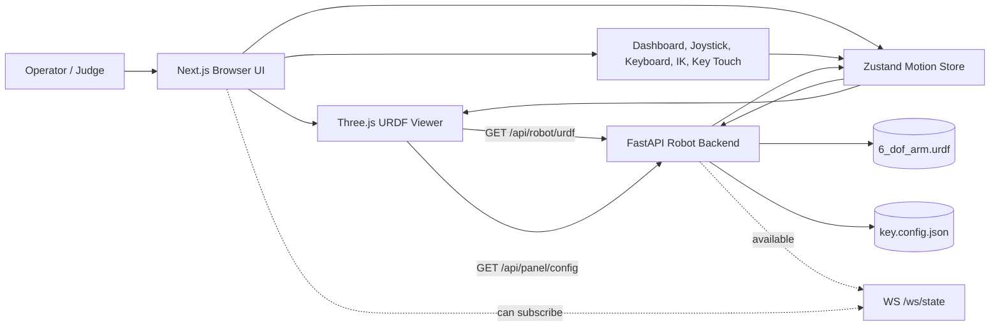
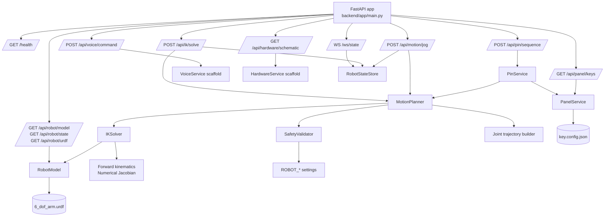
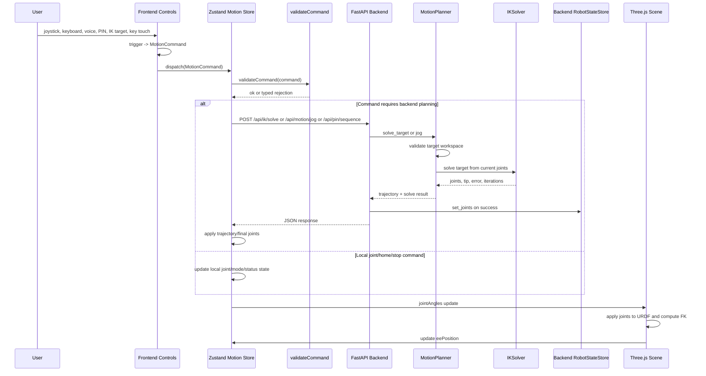
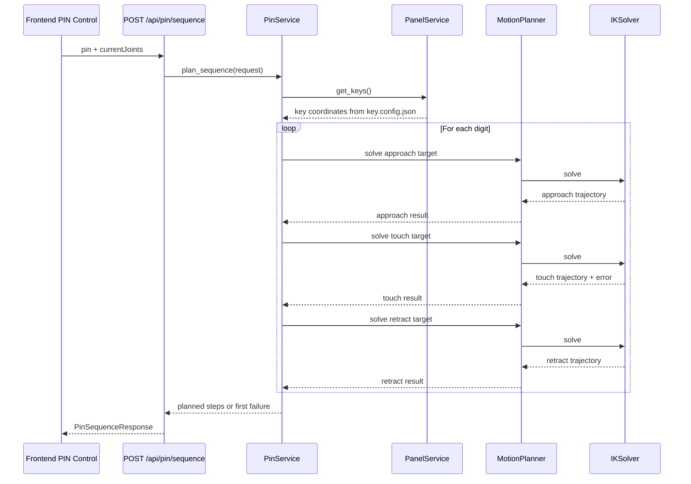
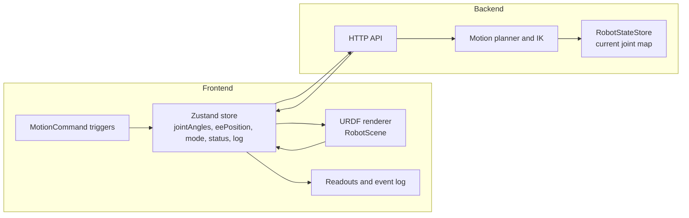
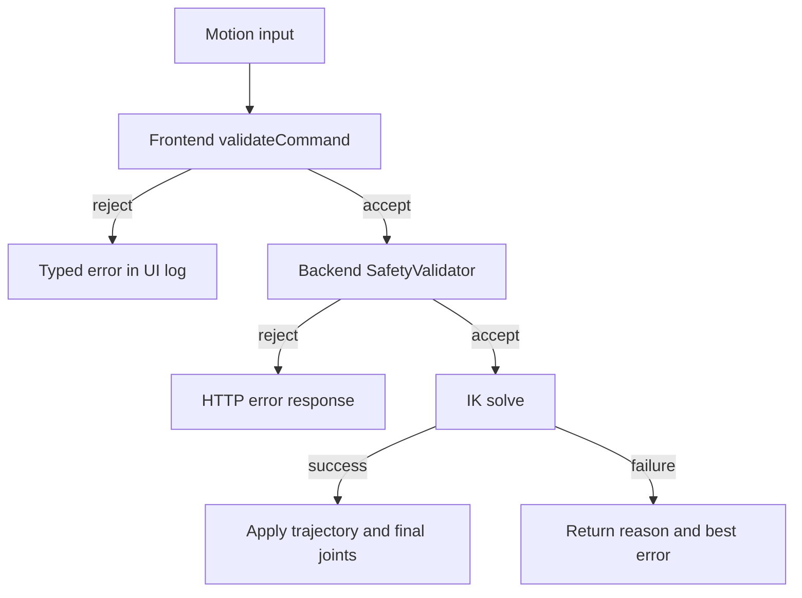
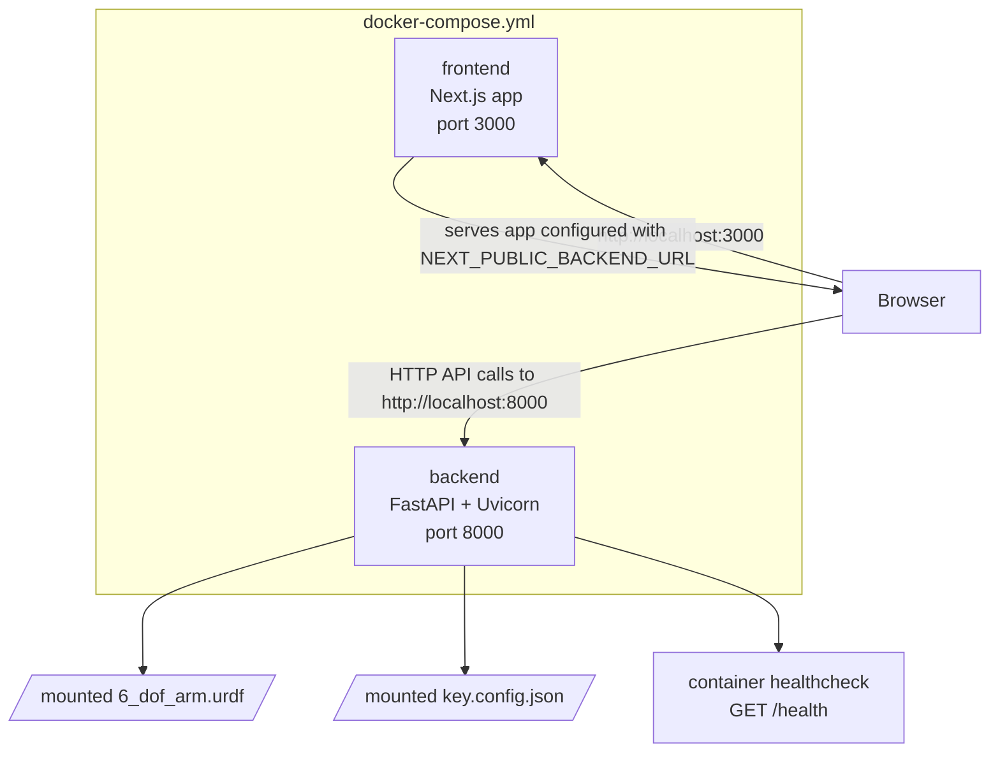

# System Architecture

This document describes the current architecture of the IUT Techathon final-round
6-DOF stylus-arm simulator. The system is a browser-based robot control suite
with a FastAPI backend for robot metadata, inverse kinematics, motion planning,
PIN sequencing, voice scaffolding, and hardware checklist metadata.

## Architecture Principles

- One motion pipeline: dashboard controls, joystick, keyboard jogs, key touches,
  voice commands, and autonomous PIN entry all produce `MotionCommand`s and go
  through the same safe path: trigger -> MotionCommand -> validate -> IK/planner -> trajectory -> apply joints.
- One robot model: `6_dof_arm.urdf` is the source of truth for the robot chain,
  controlled joints, joint limits, and TCP link.
- One panel model: `key.config.json` is the source of truth for the six test
  panel key coordinates.
- Deterministic safety before motion: frontend command validation and backend
  target validation guard motion before IK results are applied.
- Simulation first: the frontend renders and animates the robot; the backend
  computes model-aware motion plans. No real hardware is controlled by the
  current code.

## System Context

## Runtime Components

| Component          | Main paths                                                            | Responsibility                                                                                                                                  |
| ------------------ | --------------------------------------------------------------------- | ----------------------------------------------------------------------------------------------------------------------------------------------- |
| Frontend app       | `frontend/src/app/page.tsx`                                           | Builds the single-screen control dashboard.                                                                                                     |
| 3D scene           | `frontend/src/components/scene/RobotScene.tsx`                        | Owns Three.js, URDF loading, camera, panel rendering, joint dragging, and per-frame FK updates.                                                 |
| Motion store       | `frontend/src/lib/motion/store.ts`                                    | Holds authoritative frontend arm state, validates commands, calls backend motion endpoints, applies trajectories, and feeds dashboard readouts. |
| Motion contracts   | `frontend/src/lib/motion/commands.ts`                                 | Defines shared frontend command/result types for every trigger.                                                                                 |
| Backend API        | `backend/app/main.py`, `backend/app/api/*`                            | Exposes health, robot model/state, IK, jog, panel, PIN, voice, hardware, and websocket routes.                                                  |
| Motion planner     | `backend/app/motion/planner.py`                                       | Validates targets, calls IK, builds trajectories, and handles cartesian jogs.                                                                   |
| IK solver          | `backend/app/robot/ik_solver.py`                                      | Solves position-only IK with damped least squares and multiple seed poses.                                                                      |
| Robot model        | `backend/app/robot/urdf_loader.py`, `backend/app/robot/kinematics.py` | Parses the URDF and performs forward kinematics/Jacobian computation.                                                                           |
| Shared state store | `backend/app/motion/state.py`                                         | Keeps the backend's current joint map and computed TCP snapshot in memory.                                                                      |
| PIN planner        | `backend/app/pin/service.py`                                          | Converts a 6-digit PIN into approach, touch, and retract waypoints per key.                                                                     |
| Panel service      | `backend/app/panel/service.py`                                        | Reads `key.config.json` and returns raw panel config plus key coordinates in the base frame.                                                    |

## Backend Module Diagram

## Motion Command Flow

The frontend owns the rendered arm state and sends model-aware requests to the
backend whenever a command needs IK or cartesian motion. The demo pipeline is
`trigger -> MotionCommand -> validate -> IK/planner -> trajectory -> apply joints`.
Successful backend responses include final joints, TCP position, error, and a trajectory that the
frontend can animate.

## Autonomous PIN Flow

PIN planning uses the same backend motion planner as manual motion. Each digit
is expanded into an approach waypoint, touch waypoint, and retract waypoint.
The touch is considered successful only when the backend solve reaches the key
within the configured 5 mm tolerance.

## State Ownership

The frontend `jointAngles` array is the source of truth for what the operator
sees. The backend `RobotStateStore` mirrors successful backend-planned moves and
feeds `/api/robot/state` and `/ws/state`. Because the current websocket stream is
backend-originated, any frontend-only manual joint drag is local unless it is
followed by a backend-planned command.

## API Surface

| Endpoint                      | Purpose                                                                       |
| ----------------------------- | ----------------------------------------------------------------------------- |
| `GET /health`                 | Backend service health.                                                       |
| `GET /api/robot/model`        | Robot name, base link, TCP link, controlled joints, limits, and neutral pose. |
| `GET /api/robot/state`        | Current backend joint and TCP snapshot.                                       |
| `GET /api/robot/urdf`         | Inline URDF document served by the backend.                                   |
| `POST /api/ik/solve`          | Solve a target TCP position from current joints.                              |
| `POST /api/motion/jog`        | Move the TCP by a cartesian delta through the shared planner.                 |
| `GET /api/panel/config`       | Return the raw panel config used by the Three.js scene.                       |
| `GET /api/panel/keys`         | Return typed six-key coordinates from `key.config.json`.                      |
| `POST /api/pin/sequence`      | Plan approach/touch/retract trajectories for a 6-digit PIN.                   |
| `POST /api/voice/command`     | Current deterministic voice-command scaffold.                                 |
| `GET /api/hardware/schematic` | Current hardware checklist metadata scaffold.                                 |
| `WS /ws/state`                | Periodic backend state snapshot stream.                                       |

## Safety and Validation

Frontend validation catches malformed commands, joint-limit violations for
absolute joint commands, invalid PIN formats, and obvious workspace overreach.
Backend validation enforces finite target coordinates, workspace radius, and Z
bounds before IK runs. The IK solver then clamps joint maps to URDF limits and
returns a failure reason if it cannot converge within tolerance.

## Deployment Topology

Local development can run the frontend with `npm run dev` and the backend with
`uv run uvicorn app.main:app --reload`. Docker Compose runs both services, maps
the frontend to port `3000`, maps the backend to port `8000`, and mounts the URDF
and panel config into the backend container as read-only inputs.

## Current Limitations

- The voice and hardware routes are scaffolds, not completed control systems.
- The current code simulates and plans robot motion; it does not actuate real
  servos or communicate with physical hardware.
- Frontend drag/manual joint updates are local UI state. Backend state is updated
  when successful backend-planned IK or jog requests run.
- The backend state store is in memory. It is suitable for the demo runtime but
  not durable across process restarts.
