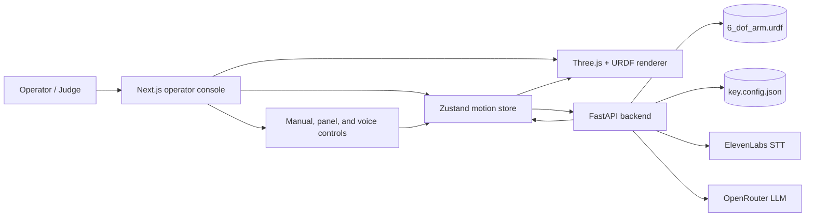
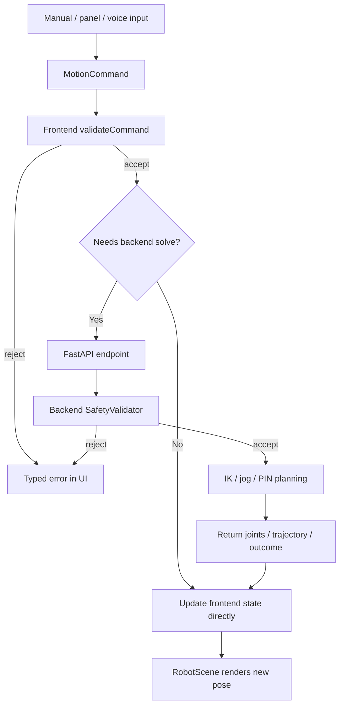

# System Architecture Overview

This is the canonical architecture summary for the current
`iut-techathon-onsite` codebase. It reflects the live implementation rather
than the earlier phase plan.

Use this file for the high-level system story. Use
[`docs/architecture/system-architecture.md`](docs/architecture/system-architecture.md)
for the deeper implementation walkthrough.

## System In One Sentence

The project is a browser-based 6-DOF stylus-arm simulator where every control
surface feeds one shared motion pipeline, the frontend owns the visible robot
state, and the backend provides robot-aware services such as IK, cartesian jog
planning, PIN sequencing, transcription, and agent interpretation.

## Architecture Principles

- One motion pipeline: manual controls, key touch, voice, and autonomous PIN
  entry all end up as `MotionCommand`s and pass through the same validation and
  execution path.
- One robot model: `6_dof_arm.urdf` is the source of truth for kinematics,
  limits, and rendered structure.
- One panel model: `key.config.json` is the source of truth for keypad
  coordinates and approach geometry.
- Frontend owns operator-visible pose: the Zustand motion store is the
  authoritative state for what the operator sees.
- Backend owns model-aware planning: FastAPI handles IK, cartesian jog solves,
  PIN waypoint planning, transcription, and agent planning support.
- Simulation first: the current system renders and plans motion, but does not
  drive physical arm hardware.

## System Context

## Runtime Components

| Layer | Main paths | Current responsibility |
| --- | --- | --- |
| Frontend shell | `frontend/src/app/page.tsx`, `frontend/src/components/layout/ControlSidebar.tsx` | Hosts the single-screen operator console and mode-specific controls. |
| Motion state | `frontend/src/lib/motion/store.ts` | Owns visible arm state, validates commands, calls backend endpoints, animates results, and records operator feedback. |
| 3D renderer | `frontend/src/components/scene/RobotScene.tsx`, `frontend/src/lib/robot/*` | Loads the URDF, renders the arm and keypad, applies joint updates, and computes FK-based readouts. |
| Voice UX | `frontend/src/components/controls/VoiceControls.tsx`, `frontend/src/lib/voice/*` | Captures audio or typed instructions, resolves deterministic commands locally, and escalates ambiguous requests to the agent route. |
| Backend API | `backend/app/main.py`, `backend/app/api/*` | Exposes health, robot, IK, motion, panel, PIN, voice, agent, hardware, and websocket endpoints. |
| Motion planning | `backend/app/motion/*`, `backend/app/robot/*` | Performs workspace checks, numerical IK, trajectory generation, and in-memory backend state snapshots. |
| PIN planner | `backend/app/pin/service.py` | Expands a PIN into approach, touch, and retract solves with a 5 mm touch tolerance check. |
| Agent layer | `backend/app/agent/*` | Uses OpenRouter to draft semantic plans, then compiles them into deterministic motion commands that still go through the normal safety path. |
| Hardware metadata | `backend/app/hardware/service.py`, `hardware/wokwi/` | Provides phase-5 schematic metadata and stores the Wokwi proof-of-concept assets. |

## Operator Flow

## API Surface That Matters Today

| Endpoint | Current role |
| --- | --- |
| `GET /health` | Backend health and Compose healthcheck target. |
| `GET /api/robot/urdf` | Serves the live URDF to the frontend renderer. |
| `GET /api/panel/config` | Serves the keypad configuration used by the scene. |
| `GET /api/panel/keys` | Serves typed keypad coordinates for motion actions. |
| `POST /api/ik/solve` | Solves a target TCP position from current joints. |
| `POST /api/motion/jog` | Applies a cartesian delta through the shared planner. |
| `POST /api/pin/sequence` | Plans full PIN entry steps through the backend planner. |
| `POST /api/voice/transcribe` | Sends recorded audio to backend-managed ElevenLabs STT. |
| `POST /api/agent/interpret` | Generates and validates semantic multi-step plans through OpenRouter. |
| `GET /api/hardware/schematic` | Returns phase-5 hardware checklist metadata. |
| `GET /api/robot/model`, `GET /api/robot/state`, `WS /ws/state` | Implemented backend visibility endpoints that are useful for tests and debugging, but are not primary UI data sources today. |

## Safety Model

The system has multiple safety layers instead of one central check:

- Frontend validation rejects malformed commands and obvious limit/workspace
  violations before a request is sent.
- Frontend joint writes clamp values to configured joint limits.
- Backend safety validation rejects impossible or out-of-bounds cartesian
  targets before IK runs.
- Backend IK clamps every iterate to the URDF limits.
- Agent-generated plans still compile into ordinary motion commands and pass
  through the same deterministic pipeline as manual commands.

## Current Boundaries

- The frontend is the source of truth for the visible pose; the backend state
  snapshot and websocket stream are secondary observability surfaces.
- Voice transcription is wired; the hardware route is still a metadata
  scaffold, not a hardware simulator or actuator controller.
- The arm solver is position-focused. Stylus orientation is not yet enforced as
  a hard planning constraint.
- The system is built for demo/runtime use, not for durable multi-user state or
  real robot actuation.

## Detailed Reference

For the deeper implementation walkthrough, including route-to-service wiring,
state ownership, endpoint usage, and current caveats, see
[`docs/architecture/system-architecture.md`](docs/architecture/system-architecture.md).
