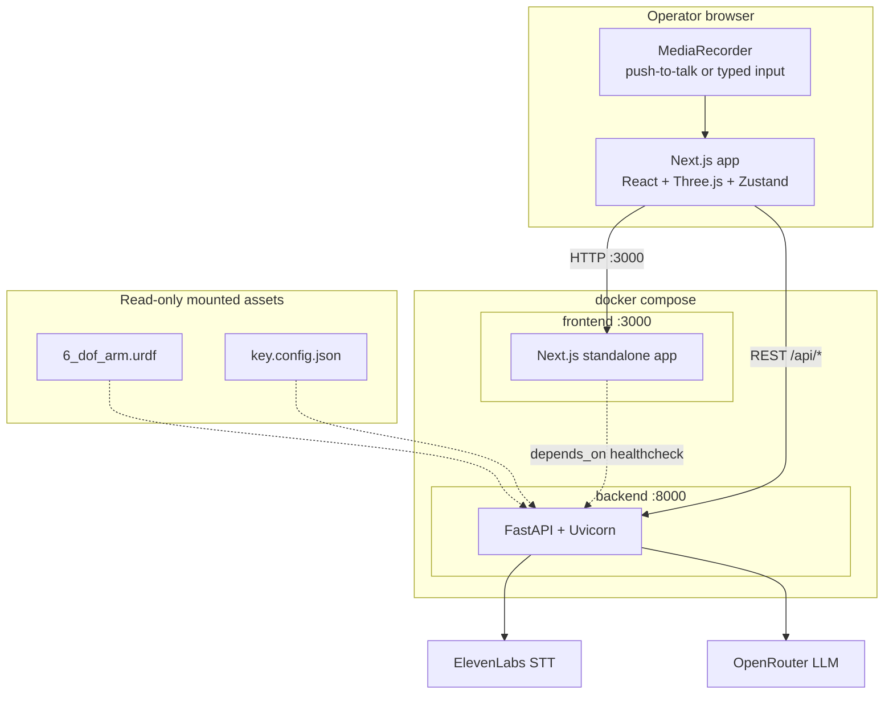
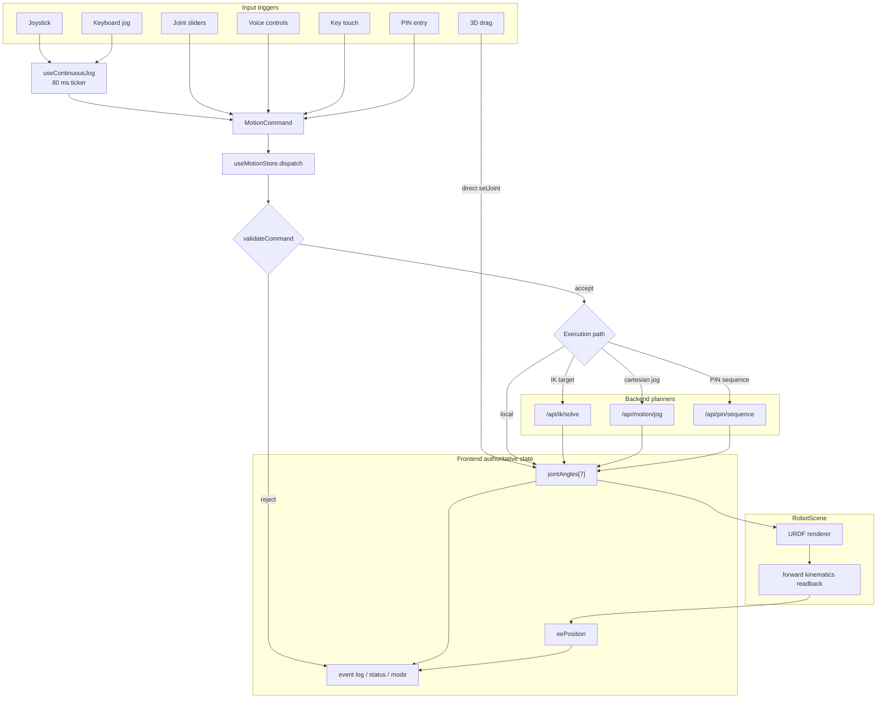
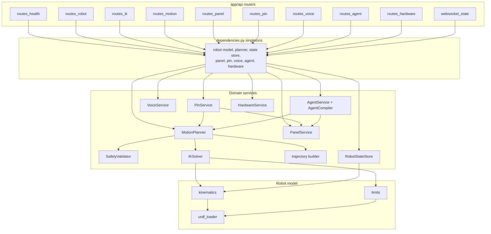
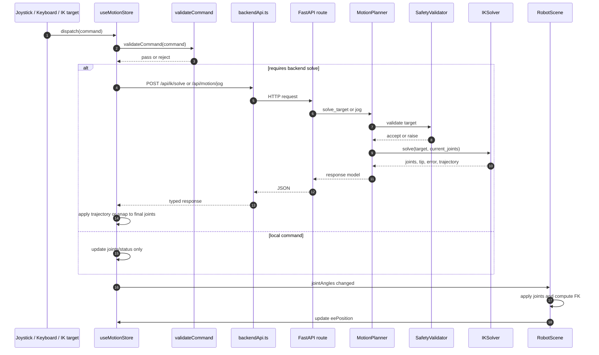
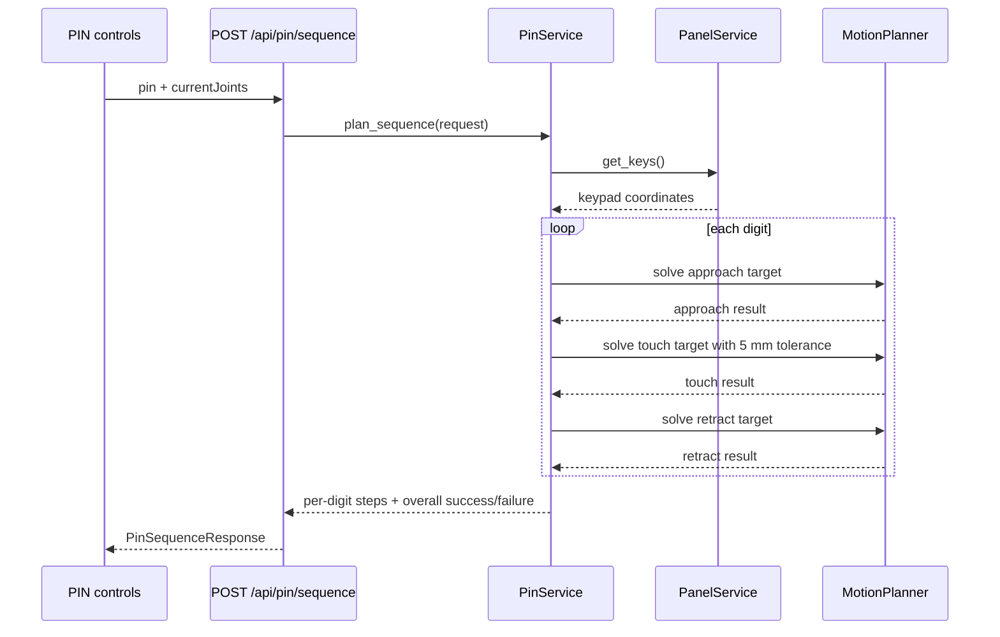
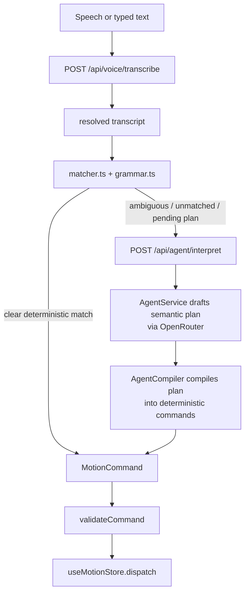
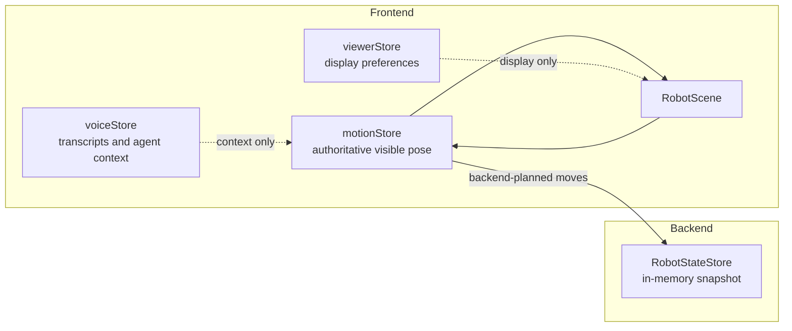
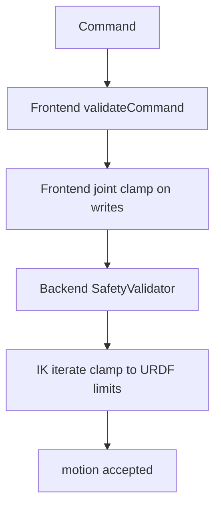

# System Architecture Deep Dive

This file is the detailed implementation reference for the current dry-run
system. It complements the canonical overview in
[`docs/architecture.md`](../architecture.md).

Use this document when you need the runtime data flow, route-to-service
structure, state ownership model, or the current technical caveats.

## Scope

- `docs/architecture.md`: short, canonical system overview.
- `docs/architecture/system-architecture.md`: contributor-facing implementation
  deep dive.

## 1. Deployment and external dependencies

Two application containers run behind Docker Compose, while speech-to-text and
agent reasoning are external API dependencies managed by the backend.

Important current truths:

- The browser never receives the ElevenLabs or OpenRouter API keys.
- The browser loads the URDF over `GET /api/robot/urdf`; it does not read the
  model from disk directly.
- `key.config.json` is served through backend routes rather than being treated
  as a frontend-owned source.

## 2. One motion pipeline, many triggers

Different controls change how a command is produced, not how motion is
validated or executed.

Nuances that matter:

- Voice commands use the same `dispatch()` path as other control surfaces after
  transcript resolution.
- Held joystick and keyboard input use the continuous jog ticker so they do not
  flood the backend.
- Direct 3D drag updates joints locally and depends on frontend clamping rather
  than the backend path.

## 3. Backend layering

FastAPI routes are thin. Service objects are created via `@lru_cache` in
`backend/app/dependencies.py`, so the URDF is parsed once per process and
shared across requests.

## 4. Core backend routes

| Route | Live behavior |
| --- | --- |
| `GET /health` | Healthcheck used by local/dev runtime and Compose. |
| `GET /api/robot/model` | Returns robot metadata, controlled joints, limits, and neutral pose. Mostly useful for tests and debugging. |
| `GET /api/robot/state` | Returns the backend's in-memory joint/TCP snapshot. |
| `GET /api/robot/urdf` | Returns the mounted URDF XML served inline to the browser. |
| `POST /api/ik/solve` | Solves a target position and updates backend state on success. |
| `POST /api/motion/jog` | Builds a jog target from current tip plus delta and updates backend state on success. |
| `GET /api/panel/config` | Returns raw panel configuration for the scene. |
| `GET /api/panel/keys` | Returns typed key coordinates for control logic. |
| `POST /api/pin/sequence` | Plans approach, touch, and retract waypoints for each PIN digit. |
| `POST /api/voice/transcribe` | Sends uploaded audio to `VoiceService`, which then calls ElevenLabs STT. |
| `POST /api/agent/interpret` | Uses OpenRouter to draft semantic steps, then compiles them into deterministic commands. |
| `GET /api/hardware/schematic` | Returns hardware checklist metadata only. |
| `WS /ws/state` | Streams the backend state snapshot every 0.2 seconds. |

## 5. IK and cartesian jog flow

Current solver facts:

- The solver is position-only, not full-pose constrained.
- It uses damped least squares with multiple seed postures.
- The backend clamps joint maps to URDF limits during solving.
- Continuous jogs can skip trajectory animation so repeated inputs stay
  responsive.

## 6. PIN flow

Older notes described PIN planning as a scaffold. That is now stale.
`PinService.plan_sequence()` is implemented and plans the sequence digit by
digit through the shared motion planner.

The key constraint is not just solve success. A touch counts only if the
reported tip error stays within the 5 mm tolerance.

## 7. Voice and agent flow

Voice is a two-stage system:

1. Speech capture and transcription.
2. Deterministic matching first, then agent escalation for ambiguity or
   compound intent.

Important current behavior:

- STT lives on the backend because secrets must stay off the client.
- The deterministic matcher still gets first chance.
- The agent does not directly actuate anything; it returns a command or
  sequence that must still pass the normal motion pipeline.
- Clarification turns are supported through `pendingPlan` state in the frontend
  voice store.

## 8. State ownership

The frontend and backend both hold state, but they play different roles.

The frontend `motionStore` is still the source of truth for what the operator
sees. The backend `RobotStateStore` mirrors successful backend-planned moves and
supports `/api/robot/state` and `/ws/state`, but the current frontend does not
depend on those endpoints for rendering.

## 9. Safety layers

What each layer covers today:

- `validate.ts`: malformed values, joint index/range issues, obvious workspace
  overreach, invalid PIN shapes, and command-structure problems.
- `store.ts`: clamps direct joint writes to configured limits, with a widened
  viewer-only range when `ignoreLimits` is enabled for drag interaction.
- `SafetyValidator`: finite cartesian target checks plus workspace radius and Z
  bounds.
- IK iteration limits: every iterate is clipped and clamped to URDF limits.

## 10. Current limitations

- The hardware route is still documentation/checklist metadata, not a live
  hardware controller.
- The system does not persist arm state across backend restarts.
- The websocket stream exists, but the current UI does not use it for
  rendering.
- Stylus orientation is not yet a hard IK objective.
- This remains a simulator/demo architecture, not a real-time industrial
  control stack.
