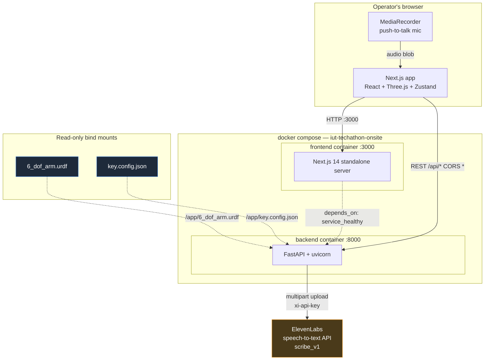
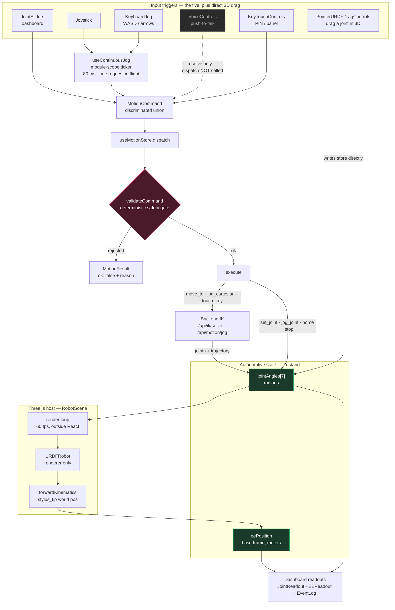
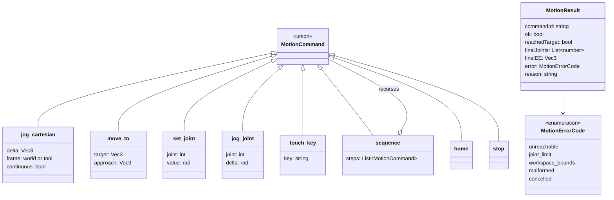
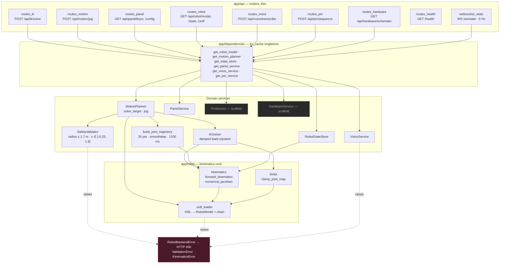
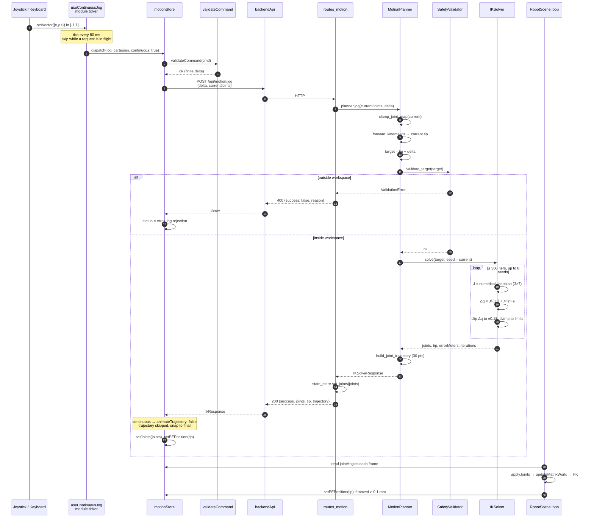
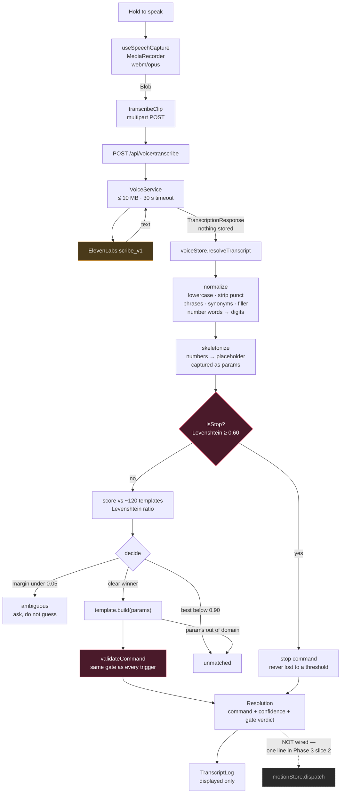
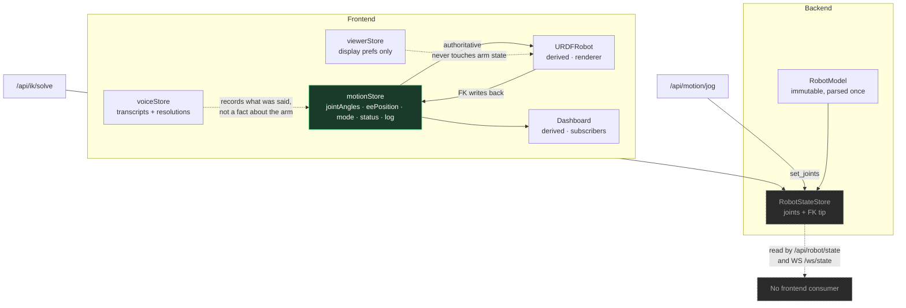
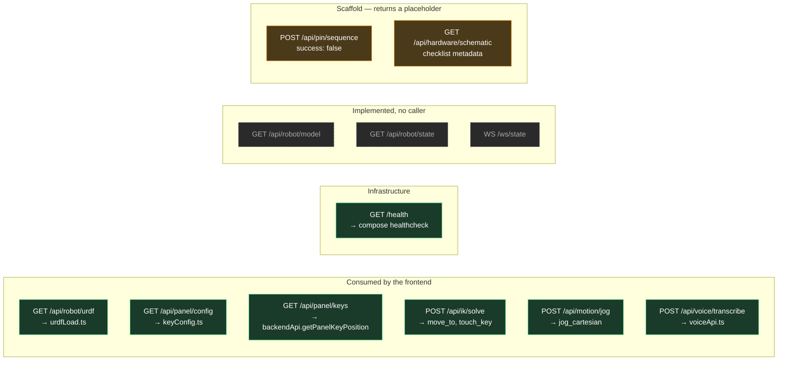
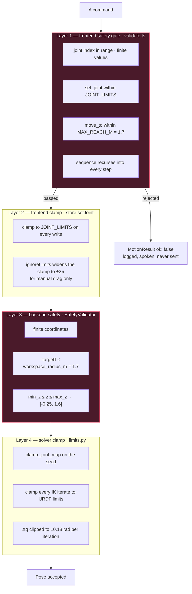

# System Architecture — Dry Run (6-DOF Stylus Arm)

Derived from the code as it stands, not from the phase briefs. Where the code and the
briefs disagree, this document follows the code and says so.

The organizing principle, stated in the README and actually upheld by `lib/motion/`, is
**one motion pipeline, five triggers**. Every input — dashboard sliders, joystick, keyboard,
voice, autonomous PIN — produces a `MotionCommand`, and nothing writes joint angles except
the motion store.

---

## 1. Containers and deployment

Two containers behind Docker Compose, plus one external SaaS dependency. The frontend
container is gated on the backend's healthcheck, and the URDF and panel config are mounted
read-only into the backend, which then *serves them to the browser* — the browser never
reads them from disk.

Two facts worth noting because they are easy to get wrong:

The **ElevenLabs API key never reaches the browser.** Next.js inlines every `NEXT_PUBLIC_*`
variable into the client bundle, so audio round-trips through the backend
(`POST /api/voice/transcribe`) rather than the browser calling ElevenLabs directly. This is
called out in both `core/config.py` and `voice/voiceApi.ts`.

The **URDF is served over HTTP, not bundled.** `robot.config.ts` points `URDF_URL` at
`${BACKEND_URL}/api/robot/urdf`, so the backend's mounted copy is the single source of truth
for both the solver and the renderer.

---

## 2. The motion pipeline — five triggers, one path

This is the diagram that matters. Read it as: everything on the left produces a
`MotionCommand`; the safety gate is unavoidable; `jointAngles` is the only authoritative
arm state; the 3D robot is a *renderer* of that state, never an owner of it.

**The voice trigger is deliberately disarmed.** `VoiceControls.tsx` resolves the transcript
into a command, shows the command and the gate's verdict, and never calls `dispatch()`.
The file says this is so the matcher can be watched against real speech-to-text errors
before it is trusted with motion.

**The 3D drag control is the one trigger that bypasses the gate**, writing `jointAngles`
directly. That is safe only because `setJoint` clamps to the URDF limits on the way in —
the clamp, not the gate, is what protects that path.

---

## 3. Command and result contracts

`commands.ts` is the cross-team interface. Every trigger produces the union on the left;
every dispatch returns the record on the right.

`reason` is human-readable on purpose — it is what a spoken or agentic feedback layer reads
back to the operator when a command is refused.

---

## 4. Backend layering

FastAPI routes are thin. Everything is constructed once via `@lru_cache` singletons in
`dependencies.py`, so the URDF is parsed exactly once per process.

---

## 5. A Cartesian jog, end to end

The most-exercised path in the app: a joystick deflection becomes an IK solve and a new pose.
Note the two rate-limiting mechanisms — the ticker's in-flight gate on the client, and the
`continuous: true` flag that suppresses trajectory animation so held-down jogs stay responsive.

The solver is **position-only** (a 3×7 Jacobian, not 6×7), so orientation is unconstrained.
That is why `_build_seeds` tries seven fixed elbow-up/elbow-down postures in addition to the
current pose: with a redundant arm and no orientation constraint, a single seed from a
singular neutral pose converges unreliably.

---

## 6. The voice pipeline

Speech-to-text is the *only* part of voice that lives on the backend. The matcher runs in the
browser, deliberately: `MotionCommand`, `validateCommand`, and `JOINTS` are already defined in
TypeScript, and mirroring them in Pydantic would create two definitions to drift apart.

Three decisions in `matcher.ts` are load-bearing and worth preserving:

Numbers are extracted **before** scoring. `"rotate base 30 degrees"` and
`"rotate base 45 degrees"` are ~92% similar as raw strings, so a flat 90% threshold would
match one against the other's template and silently discard the argument.

A near-tie is **a question, not a guess.** If the runner-up is within 0.05 of the winner the
matcher returns `ambiguous` rather than picking.

`stop` short-circuits before any scoring, at a much looser 0.60 threshold. A stop lost to a
clipped phoneme is the one failure in this grammar with real consequences; a spurious stop
is harmless.

---

## 7. State ownership

The invariant the codebase enforces: **one authoritative store, everything else derives.**

The backend's `RobotStateStore` is currently **write-only**. `/api/ik/solve` and
`/api/motion/jog` both update it, but no frontend code opens `/ws/state` or reads
`/api/robot/state` — the browser treats each solve as a pure function and keeps the pose
itself. That is a coherent design (the client owns the pose, the server owns the math), but
it means the WebSocket and the state endpoints are presently unexercised, and a second
connected client would not see the first one's motion.

---

## 8. API surface, and what is actually wired

---

## 9. Safety, in layers

Safety is checked more than once, in different places, for different reasons. This is
intentional but the layers are not identical, and the gaps are where bugs will live.

Two asymmetries fall out of reading these side by side:

**`jog_joint` and `jog_cartesian` are not bounds-checked at layer 1.** `validate.ts` checks
only that the delta is finite; the comment says the absolute limit is enforced when the delta
is applied, which is true for `jog_joint` (via the clamp) but means a `jog_cartesian` delta
is only bounds-checked once it reaches `SafetyValidator` on the backend.

**The frontend has no z-bound.** `MAX_REACH_M = 1.7` mirrors `workspace_radius_m`, but
nothing on the client mirrors `min_z_m` / `max_z_m`. A `move_to` at `z = -1.0` passes layer 1
and is refused at layer 3 — correct, but the rejection costs a round-trip and surfaces as a
backend error rather than a local one.

**`ignoreLimits` is a viewer affordance, not a safety switch.** It widens the clamp for
dragging, but `validateCommand` still enforces the real URDF limits on every dispatched
command. The gate is not weakened by it.

---

## 10. Known gaps

These are the seams left open in the code, listed so the diagram above is not read as a
description of a finished system.

The **PIN sequencing service is a scaffold.** `PinService.plan_sequence` returns
`success: false` with a message saying approach/touch/retract trajectories land after Phase 2
IK is connected. The frontend has `sequence` and `touch_key` commands that work, so PIN entry
can be composed client-side without the backend endpoint.

**Voice does not execute.** One line in `VoiceControls.tsx` connects the resolved command to
`dispatch()`.

**The keyboard and voice frames disagree.** `KeyboardJog`'s `AXIS_KEYS` maps `ArrowUp → +y`
(a top-down map metaphor); `grammar.ts` maps spoken "forward" to `+x` and "up" to `+z`
(ROS REP-103, robot-centric). Arrow-keying the arm and then saying "move left" move the tip
along different axes. The phase-3 brief recommends changing `AXIS_KEYS`.

**IK is position-only.** Orientation of the stylus is not constrained, so `approach_axis`
from `key.config.json` is currently rendered and reasoned about but not enforced by the
solver — a key press lands the tip at the coordinate without guaranteeing it arrives from
`-z`.
