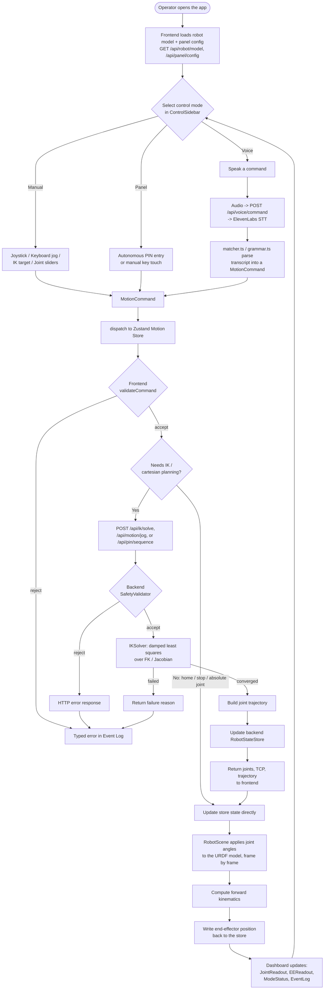
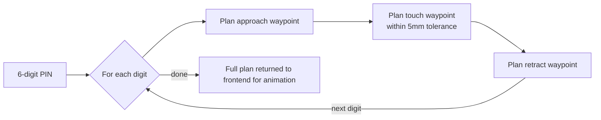

# Operator Workflow

End-to-end workflow of the 6-DOF stylus-arm simulator: from mode selection,
through command validation and motion planning, to the rendered result on
screen. This complements the component/sequence diagrams in
[architecture.md](architecture.md) with a single top-to-bottom view of the
whole operator journey.

## PIN sequence detail

The Panel mode's autonomous PIN entry drives the same planner once per digit,
expanding each digit into approach, touch, and retract waypoints:

